# SharePoint Modern Page Template: n8n Licensing Guide
*Ready-to-copy content for SharePoint modern page*

---

## Page Setup Instructions

1. **Create New Modern Page** in SharePoint
2. **Add Web Parts** in this order:
   - Hero web part (for title)
   - Text web parts (for content sections)
   - Call to action web part (for next steps)
   - Quick links web part (for resources)

3. **Set Page Properties**:
   - Title: "n8n Licensing Guide for Business Use"
   - Description: "Decision framework for workflow automation licensing"
   - Page layout: Full-width column

---

## Hero Section Content

### Title
**n8n Licensing Guide for Business Use**

### Subtitle
*Smart workflow automation for internal processes and customer-facing products*

### Background Image
*[Suggest: Abstract workflow/automation imagery in company colors]*

---

## Quick Decision Section (Callout Web Part)

### 🎯 Quick Decision Guide

**Need to determine licensing?** Answer this question:

**Who will provide the API credentials for the automation?**

- 🟢 **Our company credentials** → FREE Sustainable Use License
- 🔴 **Customer credentials** → PAID n8n Embed License  
- 🟡 **Mixed/Unclear** → Contact n8n team for clarification

---

## Executive Summary Section (Text Web Part with Collapsible)

<strong>📋 Executive Summary (Click to expand)</strong>

n8n offers workflow automation with a unique licensing model:

- **FREE** for internal business automation using your company's credentials
- **PAID** for customer-facing products where customers connect their own accounts
- **Enterprise** features available for advanced deployments

**Key Decision Point**: Licensing depends on credential ownership, not features used.

**Recommendation**: Start with free internal automation, then engage n8n commercially for customer-facing features.

---

## License Types Section (Table Web Part)

### 📜 License Types Overview

| License | Cost | What's Included | Best For |
|---------|------|-----------------|----------|
| **Sustainable Use** | FREE | Core n8n functionality | Internal automation, backend processes |
| **n8n Embed** | Commercial | Customer-facing embedding | Multi-tenant, customer credentials |
| **Enterprise** | Subscription | Advanced features (.ee files) | Large deployments, compliance |

---

## Allowed vs Not Allowed Section (Two Column Layout)

### ✅ What's ALLOWED (Free License)

#### Internal Business Operations
- Sync company data (CRM to database)
- Automate internal workflows
- Create custom n8n nodes
- Provide n8n consulting services
- Backend automation with company credentials

#### Limited Customer-Facing Use
- AI chatbots using your AI API keys
- Data processing without customer credentials
- Background automation invisible to customers

### ❌ What's NOT ALLOWED (Free License)

#### Direct Customer Access
- White-labeling n8n for customers
- Hosting n8n as a service
- Collecting customer credentials
- Multi-tenant n8n deployments

#### Revenue-Generating Features
- Products where value derives from n8n
- Reselling n8n capabilities
- Workflow-as-a-service offerings

---

## Examples Section (Accordion Web Part)

### 💼 Real-World Examples

#### ✅ ALLOWED: Customer Support Automation
**Scenario**: AI-powered support ticket routing
- **Implementation**: n8n routes tickets using company Slack credentials
- **Customer interaction**: Through your support interface
- **License needed**: FREE - because you own the credentials

#### ✅ ALLOWED: Data Processing Pipeline  
**Scenario**: Process customer uploads
- **Implementation**: n8n processes files using company infrastructure
- **Customer interaction**: Upload through your app interface
- **License needed**: FREE - no customer credentials required

#### ❌ NOT ALLOWED: Integration Platform
**Scenario**: "Zapier alternative" for customers
- **Implementation**: Customers connect their Google/Slack accounts
- **Customer interaction**: Direct n8n workflow building
- **License needed**: PAID - customers provide credentials

#### ❌ NOT ALLOWED: Workflow-as-a-Service
**Scenario**: White-labeled automation platform
- **Implementation**: Multi-tenant n8n with customer branding
- **Customer interaction**: Full n8n interface access
- **License needed**: PAID - n8n provides core value

---

## Decision Framework Section (Process Web Part)

### 🎯 Decision Framework

```mermaid
graph TD
    A[New Automation Requirement] --> B{Who owns the credentials?}
    B -->|Our Company| C[FREE License ✅]
    B -->|Our Customers| D[PAID License 💰]  
    B -->|Mixed/Unclear| E[Contact n8n 📧]
    
    C --> F[Deploy with confidence]
    D --> G[Contact license@n8n.io]
    E --> G
    
    G --> H[Discuss commercial terms]
    H --> I[Implement with n8n Embed]
```

---

## Risk Assessment Section (Summary Links Web Part)

### ⚖️ Risk Assessment

#### 🟢 Low Risk (Free License Safe)
- Internal automation only
- Company credentials and data
- Clear customer separation

#### 🟡 Medium Risk (Needs Clarification)
- Mixed internal/external use
- Complex product integration
- Unclear credential ownership

#### 🔴 High Risk (Commercial License Needed)
- Customer credential collection
- Multi-tenant architecture  
- Workflow automation as core product value

---

## Implementation Roadmap Section (Timeline Web Part)

### 🚀 Implementation Roadmap

#### Phase 1: Validate (Weeks 1-4)
- [ ] Set up internal n8n instance
- [ ] Build proof-of-concept workflows
- [ ] Test customer-facing features (without customer auth)
- [ ] Document use cases and requirements

#### Phase 2: Plan (Weeks 5-8)
- [ ] Contact n8n licensing team
- [ ] Define customer-facing architecture
- [ ] Get commercial pricing quotes
- [ ] Plan development resources

#### Phase 3: Scale (Weeks 9-12)
- [ ] Negotiate n8n Embed agreement
- [ ] Implement multi-tenant architecture
- [ ] Deploy customer-facing features
- [ ] Monitor compliance and usage

---

## Next Steps Section (Call to Action Web Part)

### 📞 Next Steps

#### For Internal Use Only
**Ready to start?** ✅ You can begin immediately with the free license

[**Download n8n**](https://n8n.io/download) | [**View Documentation**](https://docs.n8n.io)

#### For Customer-Facing Products  
**Need commercial licensing?** Contact the n8n team to discuss your use case

[**Contact n8n Licensing**](mailto:license@n8n.io) | [**Learn about n8n Embed**](https://n8n.io/embed)

#### When Uncertain
**Have questions?** The n8n team is helpful with licensing clarifications

📧 **Email**: license@n8n.io  
📖 **Reference**: [Official License FAQ](https://docs.n8n.io/sustainable-use-license/)

---

## Resources Section (Quick Links Web Part)

### 🔗 Additional Resources

#### Official Documentation
- [Sustainable Use License](https://github.com/n8n-io/n8n/blob/master/LICENSE.md)
- [License FAQ](https://docs.n8n.io/sustainable-use-license/)
- [n8n Embed Information](https://n8n.io/embed)

#### Internal Resources
- [Technical Assessment](link-to-internal-doc)
- [Cost-Benefit Analysis](link-to-internal-doc)  
- [Project Planning Template](link-to-internal-doc)

#### Contact Information
- **Project Lead**: [Your Name and Contact]
- **Technical Contact**: [Technical Lead Contact]
- **Legal Review**: [Legal Team Contact]

---

## Comments Section (Comments Web Part)

### 💬 Questions & Discussion

*Enable comments for stakeholder questions and collaborative discussion*

**Common Questions:**
- What about our specific use case X?
- How does this affect our existing integrations?
- What are the cost implications for our customer base?

---

## Page Footer (Text Web Part)

---

**Last Updated**: [Current Date]  
**Version**: 1.0  
**Next Review**: [Date + 3 months]

**Document Owner**: [Your Name]  
**Stakeholders**: [List key stakeholders]

*This document provides guidance based on current n8n licensing terms. For definitive legal interpretation, consult with n8n directly and your legal team.*

---

## SharePoint Page Setup Checklist

### Before Publishing
- [ ] Add company branding/colors
- [ ] Set appropriate permissions
- [ ] Add to navigation menu
- [ ] Configure page metadata
- [ ] Test on mobile devices

### After Publishing  
- [ ] Share with stakeholder groups
- [ ] Set up page analytics
- [ ] Schedule regular reviews
- [ ] Monitor comments and questions
- [ ] Update based on feedback

### Permissions Recommendations
- **Read**: All employees
- **Edit**: Project team members
- **Admin**: Document owner and IT

---

## Mobile Optimization Notes

The content above is optimized for SharePoint modern pages, which are mobile-responsive by default. Key considerations:

- Tables will stack on mobile
- Collapsible sections save screen space  
- Call-to-action buttons are touch-friendly
- Important information is front-loaded

Would you like me to help you set up any specific section or create additional formats?
